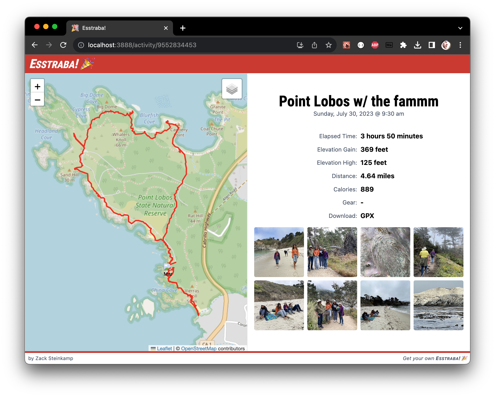

# Esstraba!

A self-hosted Strava activity and data viewer.

## The Point

These companies aren't going to be around forever. I've got stuff in Strava that
I would like to keep forever - momentos of big races, new places, time with
friends.

By running this application, you can take charge of the ownership of your
activity data and outlast Strava itself.

## Using

You will need to bulk-download your activity data. Do that by visiting the
[Account Download and
Deletion](https://www.strava.com/athlete/delete_your_account) page. It's a scary
name, but there you can request an archive download. It's currently rate-limited
to once per week, so make sure to keep that .zip in a save place!

Unzip the contents of your archive into the `data/` directory in this repo, or
change the `docker-compose.yml` file to point the `/app/data` mount at your
unzipped directory.

## Running

Run `make prod` in the root directory to build and start the server. Ensure your data dump is unzipped to the `data/` directory! The server will be listening on http://localhost:3988/ in production mode.

## Developing

The frontend and backend code are separated into their respective `frontend/` and `backend/` directories. Each of those directories has a VSCode `devcontainer` configured.

Run `make devup` in the root directory to start the frontend and backend servers in development. You can visit http://localhost:3888/ to view the application.

## TODO

- Remember sort/filter state when going back to the list from an activity
- Keyboard/mouse back/next to view photos
